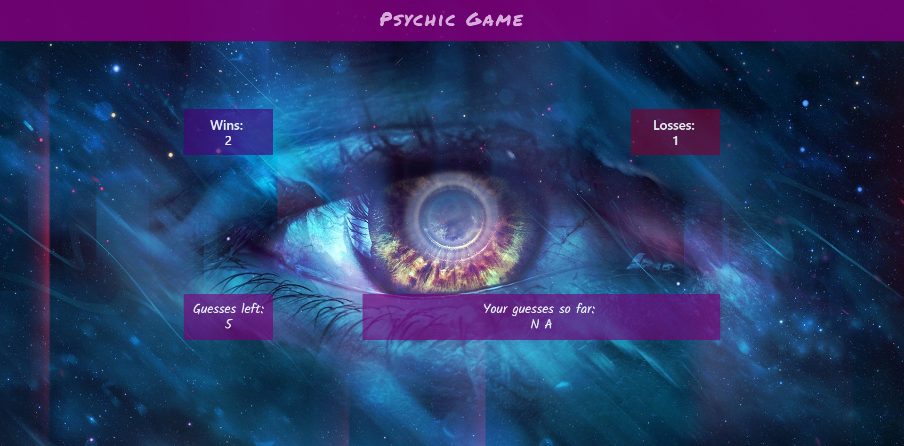

# Psychic Game
Game made with BootstrapCDN v4.1.0

Guess the randomly chosen letter correctly and win! Becareful though, you only have a limited number of tries to succeed.


## Getting Started

Open up the [project link](https://robertshaw87.github.io/Psychic-Game/) and you should be able to see the webpage shown below:



Simply press the the letter you want to guess on your keyboard. If you run out of guesses, you lose! The game will keep track of your wins and losses.

### Prerequisites

You need to have a modern browser able to handle html5, javascript, and css. 

Some popular browsers are:
```
Google Chrome
Mozilla Firefox
Safari
Opera
Edge
```

### Installing

No installation needed! Just open the page in your preferred browser.

### Behind the Scenes

There are messages logged to the console if you want to see some of the debugging messages. Or cheat if you want Mr. Rogers to be disappointed in you.

## Built With

* [BootstrapCDN v4.1.0](https://getbootstrap.com/docs/4.1/getting-started/introduction/) - The web framework used

## Authors

* **Robert Shaw** - *Initial work* - [robertshaw87](https://github.com/robertshaw87)
